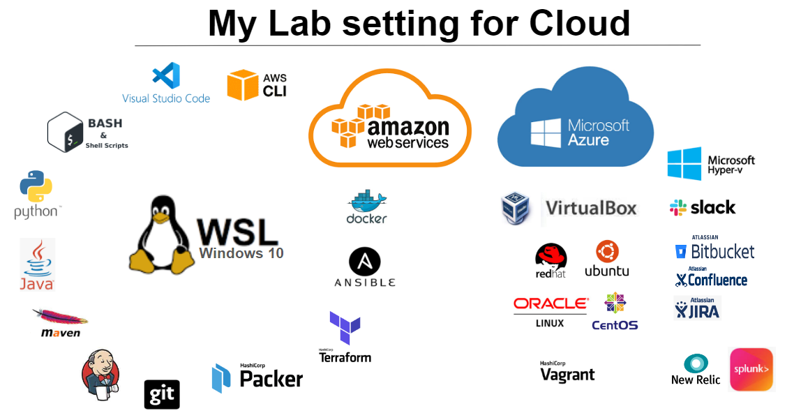

# What is  My Lab
> My lab is to experiment and learn—critical tasks for pursuing cloud computing, Linux, learning new automation tools for setting up the cloud environment, improving DevOps work skills, or experimenting with cloud services.

--- 
## Table of content  
| Name | Type | Description | Last Update |
| ----------- | ----------- | ----------- | ----------- |
| Ansible | Configuration push based | [Tutorial](https://github.com/dial2vincent/ansible_tutorial) [Mac](https://github.com/dial2vincent/ansible-virtualbox) [Use Case](https://github.com/dial2vincent/a)| 2023 |
| Bash | Linux | [Read more...](https://github.com/dial2vincent/bash) | 2023 |
| Docker | Container | [Read more...](https://dial2vincent.github.io/) | 2023 |
| Git | Version Control | [Read more...](https://dial2vincent.github.io/) | 2023 |
| Github | Git remote repository | [Read more...](https://dial2vincent.github.io/) | 2023 |
| Jenkins | CICD | [Read more...](https://dial2vincent.github.io/) | 2023 |
| Kubernetes | Container Orchestrator | [Read more...](https://dial2vincent.github.io/) | 2023 |
| Linux | CentOS Oracle RHEL Ubuntu | [Read more...](https://dial2vincent.github.io/) | 2023 |
| Packer | Image builder | [Read more...](https://dial2vincent.github.io/) | 2023 |
| Puppet | Configuration pull based | [Tutorial](https://github.com/dial2vincent/puppet) | 2023 |
| Elastic | Elasticsearch Kibana | [Read more...](https://dial2vincent.github.io/) | 2023 |
| Terraform | Provisioning | [Tutorial](https://github.com/dial2vincent/terraform) | 2023 |
--- 
## Build your lab environment 
- Host Operating System: Linux (CentOS, Oracle Linux, RHEL, Ubuntu, Windows, Mac)
- Virtual Machines: AWS, Hyper-V, Virtual Box

## Laptop
### WSL Windows
The Windows Subsystem for Linux lets developers run a GNU/Linux environment -- including most command-line tools, utilities, and applications -- directly on Windows, unmodified, without the overhead of a traditional virtual machine or dual boot setup.
- How to set up WSL on your labtop  [Read more...](https://github.com/dial2vincent/wsl)
- What applications and packages are installed on the WSL?
- [x] Application Installed on WSL: Ansible, Code, Docker, Packer, Python, Python3, Terraform
- [x] Package Installed on WSL: Bash
- [x] Application Installed on Windows: Vagrant, Virtualbox 
- [ ] Need to be Installed: Java, Jenkins, Kubernetes

## Virtual Machines 
### AWS [^1]
1. Master node: myvm, Utility Server (myvm) Requirement Tools: 
- [x] Application installed on AWS: Ansible, Docker, Git, Jenkins, Packer, Terraform
- [x] Package installed on AWS: Bash, Java, Maven, Python, Python3
- [x] Need to be installed: Visual Studio Code, Kubernetes
2. Managed node: myweb, Web Server (myweb) Requirement Tools: 
- [x] Application installed on AWS: Packer, Git, Tomcat
- [x] Package installed on AWS: Java, Python, Python3, Maven, Bash
- [ ] Need to Installed:
 
### Hyper-V [^2]
- Kubernetes master node: oracle
  - Worker Nodes: oracle1, oracle2 
- Ansible control node: utility
  - Managed node: oracle1, oracle2, ubunt2 

### VirtualBox [^3]
B:
- Kubernetes master node: K8s
  - Worker Nodes: k8s-n1, k8s-n2 
- Ansible control node: ansible
  - Managed Node: n/a 
- something here 
 
 ### Guinea
 - red
 - kitchen
 - master
 - office
 
[^1]: Location: AWS, Hosts: myvm, myweb 
[^2]: Location: Windows 2012 Hyper-v
[^3]: Location: B

## Tracking the CHANGELOG.md
1. Ansible Host Nodes: node1, ~~node2~~
2. Web Server: myweb, Requirement Tools: Tomcat server,
  
## Tips & Notes
### How to find your Github Repo Size
- Opening your Account Settings → Repositories (https://github.com/settings/repositories), and the repository size is displayed next to its designation.
